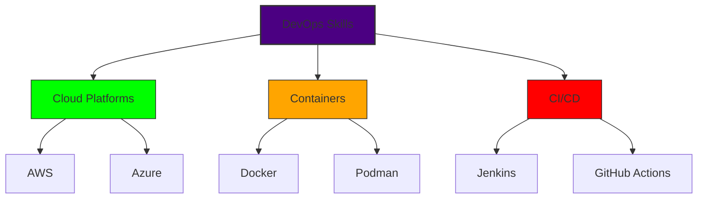
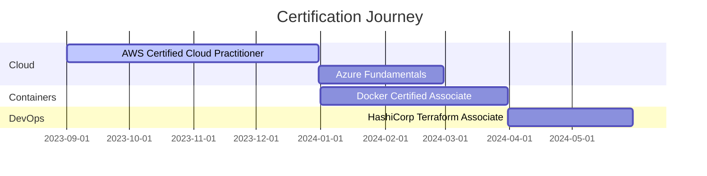

<!-- Animated Header -->
<div align="center">
  
  <h1> 
     
    Monesh Ram 
    
  </h1>
  <h3>⚡ DevOps Padawan | ☁️ Cloud Nomad | 🔧 Automation Artisan</h3>
  
  
</div>

---

### 🌀 **Skills Matrix**


---

### 🛠️ **Tech Stack Radar**
| Category       | Tools                                                                                           | Proficiency |
|----------------|-------------------------------------------------------------------------------------------------|-------------|
| **Cloud**      |               | ████░░      |
| **Containers** |               | ███░░░      |
| **CI/CD**      |             | ██░░░░      |
| **IaC**        |         | █░░░░░      |
| **Monitoring** |       | ░░░░░░      |

---

### 🌐 **DevOps Ecosystem**
<div align="center">
  
</div>

---

### 📆 **Daily Development Ritual**
```python
def devops_daily():
    morning_routine = {
        "06:00 - 07:00": "☕ Cloud Concepts Study",
        "07:30 - 09:00": "🛠️ Hands-on Lab Work"
    }
    
    afternoon_flow = [
        "⚡ Container Challenges",
        "📦 Infrastructure as Code Practice",
        "🔁 CI/CD Pipeline Config"
    ]
    
    evening_session = """
    🌙 19:00-21:00:
    - Community Learning
    - Documentation Study
    - Progress Tracking
    """
    
    return f"""
    {morning_routine}
    {afternoon_flow}
    {evening_session}
    """
```

---

### 🚧 **Certification Roadmap**


---

### 📚 **Knowledge Repository**
<details>
<summary><b>📦 Click to Explore Learning Resources</b></summary>
  
  #### 📚 Current Books
  - "The DevOps Handbook" <progress value="45" max="100"></progress>
  - "Cloud Native DevOps" <progress value="30" max="100"></progress>
  
  #### 🎓 Active Courses
  ```bash
  $ learn list
  ├── AWS Cloud Practitioner Essentials
  ├── Docker Mastery: Complete Toolset
  └── Kubernetes The Hard Way
  ```
  
  #### 🎧 Learning Playlist
  [](https://youtube.com/playlist?list=PL_sample)
</details>

---

### 🌟 **DevOps Philosophy**
> "**Infrastructure as Poetry** - Writing infrastructure code with elegance  
> **Automation as Art** - Transforming manual processes into symphonies of efficiency  
> **Failure as Fuel** - Every error is a stepping stone to mastery"

---

<!-- Interactive Footer -->
<div align="center">
  <h2>🚀 Let's Connect & Collaborate</h2>
  <p>
    <a href="https://linkedin.com/in/whoismonesh">
      
    </a>
    <a href="https://twitter.com/whoismonesh">
      
    </a>
    <a href="mailto:moneshram7@icloud.com">
      
    </a>
  </p>
  
  
  
  
  <h3>🌌 Building Tomorrow's Infrastructure Today</h3>
  <p><em>"The cloud is my canvas, automation my brush"</em> ☁️🎨</p>
</div>
