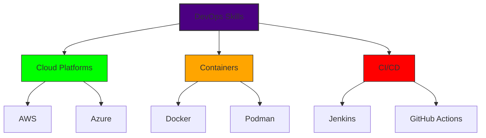
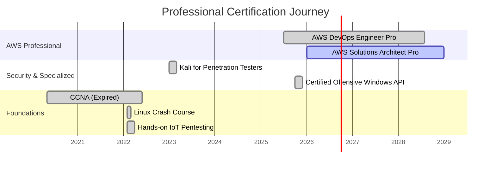

<!-- Animated Header -->
<div align="center">
  
  <h1> 
     
    Monesh Ram 
    
  </h1>
  <h3>⚡ Senior DevOps Engineer | ☁️ Cloud Architect | 🔧 Automation Expert</h3>
  
  
</div>

---

### 👨‍💻 **About Me**
I am a results-driven **Senior DevOps Engineer** with **3.5+ years of experience** in architecting and managing scalable cloud infrastructure. Based in **Nagpur**, I specialize in **AWS, Kubernetes, and Infrastructure as Code**, helping organizations transform manual processes into efficient, automated pipelines. My expertise lies in building resilient, high-availability systems and driving DevOps best practices.

- 🔭 I’m currently architecting **Enterprise-grade Kubernetes Clusters**
- 🌱 I’m currently exploring **Service Mesh & Advanced Security Automation**
- 💬 Ask me about **System Design, Cloud Cost Optimization, and SRE**
- 📫 How to reach me: **moneshram7@icloud.com**

<div align="center">
  
  
</div>

<div align="center">
  
</div>

---

### 💼 **Work Experience**
**Manager - Information Technology (DevOps / DevSecOps)** @ **Axis Bank** (Oct 2024 - Present)
- Architecting scalable financial infrastructure on AWS/Azure for high-volume transaction systems.
- Leading the migration of legacy monoliths to microservices using Kubernetes (EKS) and Istio Service Mesh.
- Designing secure CI/CD pipelines compliant with banking regulations (PCI-DSS).

**Application Support Analyst** @ **Crest IT Consulting** (Oct 2022 - Oct 2024)
- Managed operations for CRM and HRMS platforms serving 10,000+ enterprise users across multiple business units.
- Automated deployment workflows using Jenkins and Ansible, reducing release cycle time from 3 days to 4 hours.
- Implemented proactive monitoring system with custom dashboards that identified 80% of potential issues before user impact.
- Led incident response for 50+ high-severity production issues with average resolution time of 45 minutes.
- Created comprehensive runbooks and troubleshooting guides that reduced escalations to development teams by 60%.
- Collaborated with security teams to implement compliance frameworks that passed all internal and external audits with zero critical findings.

---

### 🌀 **Skills Matrix**

```mermaid
flowchart TD
    A[DevOps Skills] --> B[Cloud Platforms]
    A --> C[Containers]
    A --> D[CI/CD]
    B --> B1[AWS]
    B --> B2[Azure]
    C --> C1[Docker]
    C --> C2[Podman]
    D --> D1[Jenkins]
    D --> D2[GitHub Actions]
    
    style A fill:#4B0082,stroke:#333,stroke-width:2px
    style B fill:#00FF00,stroke:#333
    style C fill:#FFA500,stroke:#333
    style D fill:#FF0000,stroke:#333
```

---

### 🛠️ **Tech Stack Radar**
| Category       | Tools                                                                                           | Proficiency |
|----------------|-------------------------------------------------------------------------------------------------|-------------|
| **Cloud**      |               | ████░░      |
| **Containers** |               | ███░░░      |
| **CI/CD**      |             | ██░░░░      |
| **IaC**        |         | █░░░░░      |
| **Monitoring** |       | ░░░░░░      |

---

### 🌐 **DevOps Ecosystem**
<div align="center">
  
</div>

---

### 🔭 **Featured Projects**
| Project | Description | Tech Stack |
|---------|-------------|------------|
| [**RyzentoshSonomaEfi**](https://github.com/WhoisMonesh/RyzentoshSonomaEfi) | 🍎 Comprehensive guide for installing macOS Sonoma on AMD Ryzen 5 5600X. |   |
| [**Edu-Dump**](https://github.com/WhoisMonesh/Edu-Dump) | 🐍 Educational data management tool. |  |

<div align="center">
  <a href="https://github.com/WhoisMonesh?tab=repositories">
    
  </a>
</div>

---

### 📆 **Daily Development Ritual**
```python
def devops_daily():
    morning_routine = {
        "06:00 - 07:00": "☕ Cloud Concepts Study",
        "07:30 - 09:00": "🛠️ Hands-on Lab Work"
    }
    
    afternoon_flow = [
        "⚡ Container Challenges",
        "📦 Infrastructure as Code Practice",
        "🔁 CI/CD Pipeline Config"
    ]
    
    evening_session = """
    🌙 19:00-21:00:
    - Community Learning
    - Documentation Study
    - Progress Tracking
    """
    
    return f"""
    {morning_routine}
    {afternoon_flow}
    {evening_session}
    """
```

---

### 🏆 **Certifications & Achievements**
<div align="center">
  <!-- AWS Professional -->
  
  
  <br>
  <!-- Security & Specialized -->
  
  
  
</div>

<br>


```mermaid
gantt
    title Professional Certification Journey
    dateFormat  YYYY-MM-DD
    axisFormat  %Y
    
    section AWS Professional
    AWS DevOps Engineer Pro            :done, a1, 2025-07-01, 2028-07-30
    AWS Solutions Architect Pro        :active, a2, 2026-01-01, 2029-01-01
    
    section Security & Specialized
    Kali for Penetration Testers       :done, s1, 2023-01-01, 2023-03-01
    Certified Offensive Windows API    :done, s2, 2025-10-01, 2025-12-01
    
    section Foundations
    CCNA (Expired)                     :done, f1, 2020-05-01, 2022-06-01
    Linux Crash Course                 :done, f2, 2022-02-01, 2022-02-28
    Hands-on IoT Pentesting            :done, f3, 2022-02-01, 2022-03-30
```

---

### 📚 **Knowledge Repository**
<details>
<summary><b>📦 Click to Explore Learning Resources</b></summary>
  
  #### 📚 Current Books
  - "The DevOps Handbook" <progress value="45" max="100"></progress>
  - "Cloud Native DevOps" <progress value="30" max="100"></progress>
  
  #### 🎓 Active Courses
  ```bash
  $ learn list
  ├── AWS Cloud Practitioner Essentials
  ├── Docker Mastery: Complete Toolset
  └── Kubernetes The Hard Way
  ```
  
  #### 🎧 Learning Playlist
  [](https://youtube.com/playlist?list=PL_sample)
</details>

---

### 🌟 **DevOps Philosophy**
> "**Infrastructure as Poetry** - Writing infrastructure code with elegance  
> **Automation as Art** - Transforming manual processes into symphonies of efficiency  
> **Failure as Fuel** - Every error is a stepping stone to mastery"

---

<!-- Interactive Footer -->
<div align="center">
  <h2>🚀 Let's Connect & Collaborate</h2>
  <p>
    <a href="https://linkedin.com/in/whoismonesh">
      
    </a>
    <a href="https://twitter.com/whoismonesh">
      
    </a>
    <a href="mailto:moneshram7@gmail.com">
      
    </a>
  </p>
  
  
  
  
</div>
